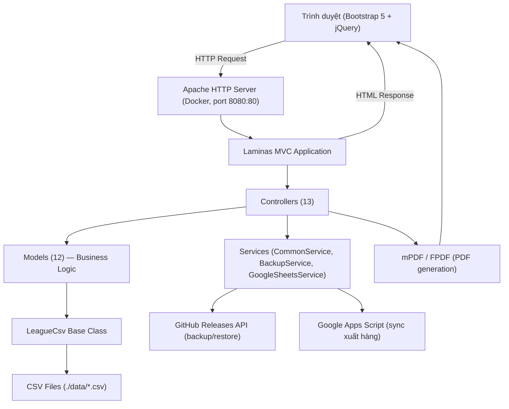

# Tài liệu Thiết kế Hệ thống: Sam Pet

## 1. Tổng quan (Overview)

**Sam Pet** là ứng dụng web quản lý cửa hàng thú cưng tích hợp phòng khám thú y. Hệ thống được xây dựng trên PHP 8.x + Laminas MVC, sử dụng file CSV làm storage thay vì database quan hệ truyền thống. Ứng dụng phục vụ đồng thời hai nghiệp vụ: **quản lý bán lẻ thú cưng / phụ kiện** (nhập hàng, xuất hàng, tồn kho, hóa đơn) và **quản lý phòng khám thú y** (hồ sơ thú nuôi, khám bệnh, điều trị, spa).

Hệ thống chạy trong Docker (Apache + PHP 8.1–8.3, cổng 8080:80), hỗ trợ backup/restore dữ liệu qua GitHub Releases và đồng bộ dữ liệu xuất hàng từ Google Sheets thông qua Apps Script.

---

## 2. Kiến trúc tổng thể (High-Level Architecture)



### Luồng xử lý request chuẩn

```
Request → index.php → Laminas Application::run()
       → Router → Controller (action)
       → Model (đọc/ghi CSV qua LeagueCsv)
       → View (phtml template)
       → Response → Browser
```

---

## 3. Tech Stack

| Thành phần | Công nghệ | Phiên bản |
|-----------|-----------|-----------|
| Backend language | PHP | 8.1 – 8.3 |
| MVC Framework | Laminas MVC | ^3.7 |
| CSV I/O | League/CSV | ^9.18 |
| Logging | Monolog | ^3.8 |
| PDF | mPDF + FPDF | ^8.2 / ^1.8 |
| Session | Laminas Session | — |
| Flash messages | Laminas FlashMessenger | — |
| Frontend CSS | Bootstrap | 5 (local) |
| Frontend JS | jQuery | 3.7.1 (CDN) |
| DataTables | DataTables | 2.1.8 (CDN) |
| Dropdown search | Select2 | 4.1.0 (CDN) |
| Date picker | Bootstrap Datepicker | 1.10.0 (CDN) |
| Charts | Highcharts | (CDN, dùng trong overview) |
| Container | Docker | Apache + PHP image |
| Testing | PHPUnit + laminas-test | ^10 |
| Static analysis | Psalm | — |
| Code style | PHPCS | — |

---

## 4. Cấu trúc Module (Module Structure)

```
module/Application/
├── config/
│   └── module.config.php          # Routes, controller factories, view, services, session config
├── src/
│   ├── Module.php                 # Module bootstrap (onBootstrap, getConfig, getServiceConfig)
│   ├── Controller/
│   │   ├── OverviewController.php
│   │   ├── ProductController.php
│   │   ├── StocktakingController.php
│   │   ├── ImportStockController.php
│   │   ├── ExportStockController.php
│   │   ├── ExportInvoiceController.php
│   │   ├── VetCareController.php
│   │   ├── ExpensesController.php
│   │   ├── ReportController.php
│   │   ├── PdfController.php
│   │   ├── OwnerPetController.php
│   │   ├── MedicalRecordController.php
│   │   └── SettingsController.php
│   ├── Model/
│   │   ├── Product.php
│   │   ├── ImportStock.php
│   │   ├── ExportStock.php
│   │   ├── VetCare.php
│   │   ├── Expenses.php
│   │   ├── Report.php
│   │   ├── ExportInvoice.php
│   │   ├── OwnerPet.php
│   │   ├── MedicalRecord.php
│   │   ├── Stocktaking.php
│   │   ├── RepackageHistory.php
│   │   └── PdfGenerator.php
│   ├── Service/
│   │   ├── CommonService.php      # Static utility methods
│   │   ├── BackupService.php      # GitHub Releases backup/restore
│   │   └── GoogleSheetsService.php # Google Apps Script integration
│   └── Library/
│       └── LeagueCsv.php          # Base class cho tất cả Models
└── view/
    └── application/
        ├── overview/              # index.phtml, expenses.phtml
        ├── product/               # index.phtml, add.phtml, edit.phtml
        ├── stocktaking/           # index.phtml
        ├── import-stock/          # index.phtml, add.phtml, edit.phtml
        ├── export-stock/          # index.phtml, add.phtml, edit.phtml
        ├── export-invoice/        # index.phtml, add.phtml, edit.phtml
        ├── vet-care/              # index.phtml, add.phtml, edit.phtml
        ├── expenses/              # index.phtml, add.phtml, edit.phtml
        ├── report/                # index.phtml, add.phtml, edit.phtml
        ├── owner-pet/             # index.phtml, add.phtml, edit.phtml
        ├── medical-record/        # index.phtml, add.phtml, edit.phtml, history.phtml
        ├── settings/              # index.phtml
        └── layout/
            └── layout.phtml       # Master layout chung
```

---

## 5. Biến môi trường (Environment Variables)

File: `.env` (tại root project)

| Biến | Mô tả | Ví dụ |
|------|-------|-------|
| `STORE_NAME` | Tên cửa hàng, hiển thị trong layout navbar và PDF | `Sam Pet` |
| `ADDRESS` | Địa chỉ cửa hàng, dùng trong header PDF hóa đơn | `123 Đường ABC, Q.1, TP.HCM` |
| `MST_CODE` | Mã số thuế, in trên PDF hóa đơn | `0123456789` |
| `MST_NAME` | Tên đăng ký thuế, in trên PDF hóa đơn | `HỘ KINH DOANH SAM PET` |
| `APP_ENV` | Môi trường ứng dụng: `dev` hoặc `prod` | `prod` |
| `GITHUB_TOKEN` | Personal Access Token GitHub (scope: repo) | `ghp_xxx...` |
| `GITHUB_REPO_OWNER` | GitHub username/org | `username` |
| `GITHUB_REPO_NAME` | GitHub repository name | `sam-pet-backup` |

---

## 6. Lưu trữ dữ liệu (Data Storage — CSV Schema)

Tất cả dữ liệu được lưu trong thư mục `./data/`. Mỗi entity tương ứng một file CSV với header row. Không sử dụng database.

### Quy tắc chung
- **Primary key**: field `id` = `uniqid()` (PHP), trừ `stocktaking.csv` dùng `productId` làm `id`
- **Timestamps**: mỗi row có `createdAt` và `updatedAt` lưu dưới dạng Unix timestamp (int)
- **Định dạng ngày**: `dd-mm-yyyy` (ví dụ: `25-12-2024`)
- **Số thực**: lưu dưới dạng float thuần (không format, không đơn vị)
- **JSON**: một số field lưu JSON string (ví dụ: `export-invoice.csv.content`)

### 6.1 `product.csv`

| Field | Kiểu | Mô tả |
|-------|------|-------|
| id | string | uniqid() |
| name | string | Tên sản phẩm |
| unit | string | Đơn vị tính (hộp, gói, con, ...) |
| sellingPrice | float | Giá bán lẻ (VNĐ) |
| purchasePrice | float | Giá nhập (VNĐ) |
| initStock | float | Tồn kho ban đầu (sau kiểm kê gần nhất) |
| repackageStock | float | Tồn kho từ chiết hàng (cộng/trừ khi doRepackage) |
| invoiceCheck | string | `"1"` = in hóa đơn, `"0"` = không in |
| createdAt | int | Unix timestamp |
| updatedAt | int | Unix timestamp |

### 6.2 `import-stock.csv`

| Field | Kiểu | Mô tả |
|-------|------|-------|
| id | string | uniqid() |
| date | string | Ngày nhập (dd-mm-yyyy) |
| productId | string | FK → product.csv.id |
| productName | string | Tên sản phẩm (denormalized) |
| quantity | float | Số lượng nhập |
| purchasePrice | float | Giá nhập tại thời điểm đó |
| note | string | Ghi chú |
| createdAt | int | Unix timestamp |
| updatedAt | int | Unix timestamp |

### 6.3 `export-stock.csv`

| Field | Kiểu | Mô tả |
|-------|------|-------|
| id | string | uniqid() |
| date | string | Ngày xuất (dd-mm-yyyy) |
| productId | string | FK → product.csv.id |
| productName | string | Tên sản phẩm (denormalized) |
| quantity | float | Số lượng xuất |
| sellingPrice | float | Giá bán tại thời điểm đó |
| purchasePrice | float | Giá nhập tại thời điểm đó (để tính lợi nhuận) |
| note | string | Ghi chú |
| createdAt | int | Unix timestamp |
| updatedAt | int | Unix timestamp |

### 6.4 `vet-care.csv`

| Field | Kiểu | Mô tả |
|-------|------|-------|
| id | string | uniqid() |
| date | string | Ngày (dd-mm-yyyy) |
| treatmentAmount | float | Doanh thu điều trị (VNĐ) |
| spaAmount | float | Doanh thu spa (VNĐ) |
| note | string | Ghi chú |
| createdAt | int | Unix timestamp |
| updatedAt | int | Unix timestamp |

### 6.5 `expenses.csv`

| Field | Kiểu | Mô tả |
|-------|------|-------|
| id | string | uniqid() |
| date | string | Ngày (dd-mm-yyyy) |
| type | string | `"0"` = chi phí thường, `"1"` = tiết kiệm |
| reason | string | Lý do chi |
| amount | float | Số tiền (VNĐ) |
| person | string | Người thực hiện |
| note | string | Ghi chú |
| createdAt | int | Unix timestamp |
| updatedAt | int | Unix timestamp |

### 6.6 `report.csv`

| Field | Kiểu | Mô tả |
|-------|------|-------|
| id | string | uniqid() |
| date | string | Ngày báo cáo (dd-mm-yyyy) |
| petShopRevenue | float | Doanh thu cửa hàng thú cưng |
| petShopProfit | float | Lợi nhuận cửa hàng thú cưng |
| spaRevenue | float | Doanh thu spa |
| treatmentRevenue | float | Doanh thu điều trị |
| expenses | float | Tổng chi phí ngày đó |
| savings | float | Tiền tiết kiệm ngày đó |
| missingAmount | float | Tiền hụt (chênh lệch) |
| note | string | Ghi chú |
| createdAt | int | Unix timestamp |
| updatedAt | int | Unix timestamp |

### 6.7 `export-invoice.csv`

| Field | Kiểu | Mô tả |
|-------|------|-------|
| id | string | uniqid() |
| date | string | Ngày hóa đơn (dd-mm-yyyy) |
| content | string | JSON blob (xem cấu trúc bên dưới) |
| total | float | Tổng tiền hóa đơn |
| createdAt | int | Unix timestamp |
| updatedAt | int | Unix timestamp |

**Cấu trúc JSON của `content`:**
```json
{
  "product": [
    {
      "id": "product_id",
      "name": "Tên sản phẩm",
      "unit": "Đơn vị",
      "quantity": 2,
      "sellingPrice": 50000,
      "total": 100000
    }
  ],
  "spa": {
    "desc": "Mô tả dịch vụ spa",
    "total": 150000
  },
  "treatment": {
    "desc": "Mô tả dịch vụ điều trị",
    "total": 200000
  }
}
```

### 6.8 `owners_pets.csv`

| Field | Kiểu | Mô tả |
|-------|------|-------|
| id | string | uniqid() |
| owner_name | string | Tên chủ sở hữu |
| phone | string | Số điện thoại |
| pet_name | string | Tên thú cưng |
| species | string | Loài (chó, mèo, ...) |
| breed | string | Giống |
| gender | string | Giới tính |
| age | string | Tuổi / năm sinh |
| note | string | Ghi chú |
| createdAt | int | Unix timestamp |
| updatedAt | int | Unix timestamp |

### 6.9 `medical_records.csv`

| Field | Kiểu | Mô tả |
|-------|------|-------|
| id | string | uniqid() |
| pet_id | string | FK → owners_pets.csv.id |
| visit_date | string | Ngày khám (dd-mm-yyyy) |
| symptoms | string | Triệu chứng |
| diagnosis | string | Chẩn đoán |
| prescription | string | Đơn thuốc / phác đồ điều trị |
| start_date | string | Ngày bắt đầu điều trị (dd-mm-yyyy) |
| end_date | string | Ngày kết thúc điều trị (dd-mm-yyyy) |
| createdAt | int | Unix timestamp |
| updatedAt | int | Unix timestamp |

### 6.10 `stocktaking.csv`

| Field | Kiểu | Mô tả |
|-------|------|-------|
| id | string | = productId (FK → product.csv.id) |
| stocktaking | float | Số lượng kiểm kê thực tế |
| createdAt | int | Unix timestamp |
| updatedAt | int | Unix timestamp |

> **Lưu ý**: `id` trong bảng này là `productId`, không phải uniqid(). Mỗi sản phẩm có đúng 1 row.

### 6.11 `repackage_history.csv`

| Field | Kiểu | Mô tả |
|-------|------|-------|
| id | string | uniqid() |
| date | string | Ngày chiết hàng (dd-mm-yyyy) |
| content | string | Mô tả chi tiết thao tác chiết hàng |
| createdAt | int | Unix timestamp |
| updatedAt | int | Unix timestamp |

### 6.12 Thư mục con trong `./data/`

| Thư mục | Mục đích |
|---------|---------|
| `./data/backup_stocktaking/` | Lưu file ZIP backup trước mỗi lần kiểm kê (renewWarehouse) |
| `./data/cache/` | Lưu file tạm: `backup.zip`, `backup_restore.zip`, temp mPDF |
| `./data/mpdf/` | Thư mục temp cho thư viện mPDF |

---

## 7. Routes

Pattern tạo route: `createSegmentRoute($controller, $baseRoute, $childRoutes)`
- Action mặc định: `index`
- Child route mặc định: `[/:action]`

| Route name | Base URL | Controller | Child routes (action:param) |
|-----------|---------|-----------|---------------------------|
| default | `/` | OverviewController | — |
| overview | `/overview` | OverviewController | — |
| product | `/product` | ProductController | `edit/:id`, `delete/:id` |
| stocktaking | `/stocktaking` | StocktakingController | — |
| exportStock | `/export-stock` | ExportStockController | `edit/:date`, `delete/:id`, `sync-preview`, `do-sync` |
| exportInvoice | `/export-invoice` | ExportInvoiceController | `add/:date`, `edit/:id`, `pdf/:id` |
| importStock | `/import-stock` | ImportStockController | `edit/:date`, `delete/:id` |
| vetCare | `/vet-care` | VetCareController | `edit/:id`, `delete/:id` |
| expenses | `/expenses` | ExpensesController | `edit/:date`, `delete/:id` |
| report | `/report` | ReportController | `edit/:id`, `delete/:id` |
| pdf | `/pdf` | PdfController | — |
| ownerPet | `/owner-pet` | OwnerPetController | `edit/:id`, `delete/:id` |
| medicalRecord | `/medical-record` | MedicalRecordController | `add/:petId`, `edit/:id`, `history/:petId` |
| settings | `/settings` | SettingsController | `do-restore` |

---

## 8. Controllers

Tất cả Controller kế thừa `Laminas\Mvc\Controller\AbstractActionController`. Dependency injection thông qua constructor (ServiceLocator factory trong `module.config.php`).

### 8.1 OverviewController

Hiển thị dashboard tổng quan với biểu đồ doanh thu.

| Action | Method | Mô tả |
|--------|--------|-------|
| `indexAction()` | GET | Lấy toàn bộ Report data → format cho Highcharts chart (doanh thu + lợi nhuận theo ngày) |
| `expensesAction()` | GET | Tương tự indexAction nhưng hiển thị chart expenses và savings |

**Dependencies**: `Report` model

### 8.2 ProductController

Quản lý danh mục sản phẩm + tính toán tồn kho.

| Action | Method | Mô tả |
|--------|--------|-------|
| `indexAction()` | GET | Danh sách sản phẩm với tồn kho tính toán, bảng tổng kết |
| `addAction()` | GET | Form thêm sản phẩm mới |
| `doAddAction()` | POST | Xử lý thêm sản phẩm, redirect → index |
| `editAction($id)` | GET | Form sửa sản phẩm theo `id` |
| `doEditAction()` | POST | Xử lý sửa sản phẩm, redirect → index |
| `doDeleteAction()` | POST | Xóa sản phẩm, trả về JSON `{success: true/false}` |
| `dataTableServerSideAction()` | POST | AJAX: filter/sort/paginate cho DataTables |
| `doRepackageAction()` | POST | Chiết hàng: trừ SL từ sản phẩm lớn, cộng vào sản phẩm nhỏ |
| `doAddInvoiceCheckAction()` | POST | Toggle `invoiceCheck` cho một hoặc nhiều sản phẩm |

**Dependencies**: `Product`, `ImportStock`, `ExportStock` models

### 8.3 StocktakingController

Quản lý kiểm kê tồn kho định kỳ.

| Action | Method | Mô tả |
|--------|--------|-------|
| `indexAction()` | GET | Hiển thị bảng kiểm kê: danh sách sản phẩm + remainStock tính toán + input số lượng kiểm kê |
| `doEditAction()` | POST | Cập nhật giá trị `stocktaking` cho từng sản phẩm |
| `doRenewWarehouseAction()` | POST | Thực hiện kiểm kê: backup → reset tồn kho → xóa lịch sử nhập/xuất |

**Dependencies**: `Stocktaking`, `Product`, `ImportStock`, `ExportStock` models; `CommonService`

### 8.4 ImportStockController

Quản lý phiếu nhập hàng.

| Action | Method | Mô tả |
|--------|--------|-------|
| `indexAction()` | GET | Danh sách phiếu nhập (DataTables) |
| `addAction()` | GET | Form thêm phiếu nhập (có thể thêm nhiều dòng cùng ngày) |
| `doAddAction()` | POST | Xử lý thêm nhiều dòng nhập cùng lúc (addRows) |
| `editAction($date)` | GET | Form sửa toàn bộ phiếu nhập của một ngày |
| `doEditAction()` | POST | Xóa hết rows cũ theo ngày → insert rows mới (replace-all strategy) |
| `doDeleteAction()` | POST | Xóa một dòng nhập theo `id`, trả về JSON |
| `dataTableServerSideAction()` | POST | AJAX DataTables |

**Dependencies**: `ImportStock`, `Product` models

### 8.5 ExportStockController

Quản lý phiếu xuất hàng + đồng bộ từ Google Sheets.

| Action | Method | Mô tả |
|--------|--------|-------|
| `indexAction()` | GET | Danh sách phiếu xuất (DataTables) |
| `addAction()` | GET | Form thêm phiếu xuất |
| `doAddAction()` | POST | Xử lý thêm nhiều dòng xuất cùng lúc |
| `editAction($date)` | GET | Form sửa phiếu xuất theo ngày |
| `doEditAction()` | POST | Replace-all strategy cho ngày được chỉnh |
| `doDeleteAction()` | POST | Xóa một dòng, trả về JSON |
| `dataTableServerSideAction()` | POST | AJAX DataTables |
| `syncPreviewAction()` | POST | Gọi GoogleSheetsService → filterNewRows → trả JSON preview `{newRows: [...]}` |
| `doSyncAction()` | POST | Validate + filterNewRows lần 2 (chống race condition) → importFromSheets → redirect |

**Dependencies**: `ExportStock`, `Product` models; `GoogleSheetsService`

### 8.6 VetCareController

Quản lý doanh thu điều trị và spa theo ngày.

| Action | Method | Mô tả |
|--------|--------|-------|
| `indexAction()` | GET | Danh sách các bản ghi vet-care (DataTables) |
| `addAction()` | GET | Form thêm bản ghi mới |
| `doAddAction()` | POST | Xử lý thêm, redirect |
| `editAction($id)` | GET | Form sửa bản ghi theo `id` |
| `doEditAction()` | POST | Xử lý sửa, redirect |
| `doDeleteAction()` | POST | Xóa, trả JSON |
| `dataTableServerSideAction()` | POST | AJAX DataTables |

**Dependencies**: `VetCare` model

### 8.7 ExpensesController

Quản lý chi phí vận hành và tiền tiết kiệm.

| Action | Method | Mô tả |
|--------|--------|-------|
| `indexAction()` | GET | Danh sách chi phí (DataTables) |
| `addAction()` | GET | Form thêm chi phí (chọn type: thường / tiết kiệm) |
| `doAddAction()` | POST | Xử lý thêm nhiều dòng cùng ngày |
| `editAction($date)` | GET | Form sửa toàn bộ chi phí của một ngày |
| `doEditAction()` | POST | Replace-all strategy theo ngày |
| `doDeleteAction()` | POST | Xóa một dòng, trả JSON |
| `dataTableServerSideAction()` | POST | AJAX DataTables |

**Dependencies**: `Expenses` model

### 8.8 ReportController

Quản lý báo cáo thu – chi hàng ngày. Sau mỗi thao tác ghi, trigger backup GitHub async.

| Action | Method | Mô tả |
|--------|--------|-------|
| `indexAction()` | GET | Danh sách báo cáo (DataTables) |
| `addAction()` | GET | Form thêm báo cáo |
| `doAddAction()` | POST | Xử lý thêm → trigger `BackupService::backup()` async |
| `editAction($id)` | GET | Form sửa báo cáo theo `id` |
| `doEditAction()` | POST | Xử lý sửa → trigger backup async |
| `doDeleteAction()` | POST | Xóa, trả JSON |
| `dataTableServerSideAction()` | POST | AJAX DataTables |

**Dependencies**: `Report` model; `BackupService` (constructor inject)

> **Backup async**: sau doAdd/doEdit thành công, gọi `BackupService::backup()` không block response (dùng `CommonService::executeCommand()` chạy background).

### 8.9 PdfController

Tạo và trả về file PDF doanh thu (Mẫu S1a-HKD).

| Action | Method | Mô tả |
|--------|--------|-------|
| `indexAction()` | GET | Nhận params (date range, …) → gọi `PdfGenerator::generate()` → output PDF inline |

**Dependencies**: `PdfGenerator`, `ExportStock`, `VetCare` models

### 8.10 ExportInvoiceController

Quản lý hóa đơn xuất bán (Sổ chi tiết doanh thu).

| Action | Method | Mô tả |
|--------|--------|-------|
| `indexAction()` | GET | Danh sách hóa đơn (DataTables) |
| `addAction($date)` | GET | Form tạo hóa đơn, pre-fill data từ export-stock + vet-care của `$date` |
| `doAddAction()` | POST | Xử lý lưu hóa đơn (content JSON) |
| `editAction($id)` | GET | Form sửa hóa đơn |
| `doEditAction()` | POST | Xử lý cập nhật |
| `doDeleteAction()` | POST | Xóa, trả JSON |
| `dataTableServerSideAction()` | POST | AJAX DataTables |
| `pdfAction($id)` | GET | Gọi `ExportInvoice::generatePdf($id)` → output PDF mPDF inline |

**Dependencies**: `ExportInvoice`, `ExportStock`, `VetCare`, `Product` models

### 8.11 OwnerPetController

Quản lý hồ sơ chủ sở hữu và thú cưng.

| Action | Method | Mô tả |
|--------|--------|-------|
| `indexAction()` | GET | Danh sách chủ + thú cưng (DataTables) |
| `addAction()` | GET | Form thêm hồ sơ mới |
| `doAddAction()` | POST | Xử lý thêm |
| `editAction($id)` | GET | Form sửa hồ sơ |
| `doEditAction()` | POST | Xử lý cập nhật |
| `doDeleteAction()` | POST | Xóa, trả JSON |
| `dataTableServerSideAction()` | POST | AJAX DataTables |
| `searchAction()` | GET/POST | Tìm kiếm thú cưng theo tên, trả JSON `[{id, pet_name, owner_name, phone, ...}]` |

**Dependencies**: `OwnerPet` model

### 8.12 MedicalRecordController

Quản lý hồ sơ khám bệnh / điều trị thú cưng.

| Action | Method | Mô tả |
|--------|--------|-------|
| `indexAction()` | GET | Danh sách tất cả hồ sơ khám (DataTables, join với OwnerPet) |
| `addAction($petId)` | GET | Form thêm hồ sơ khám cho `$petId` |
| `doAddAction()` | POST | Xử lý thêm hồ sơ khám |
| `editAction($id)` | GET | Form sửa hồ sơ khám |
| `doEditAction()` | POST | Xử lý cập nhật |
| `doDeleteAction()` | POST | Xóa, trả JSON |
| `dataTableServerSideAction()` | POST | AJAX DataTables |
| `historyAction($petId)` | GET | Xem toàn bộ lịch sử khám theo `$petId` |

**Dependencies**: `MedicalRecord`, `OwnerPet` models

### 8.13 SettingsController

Cài đặt hệ thống, backup và restore dữ liệu.

| Action | Method | Mô tả |
|--------|--------|-------|
| `indexAction()` | GET | Trang cài đặt: hiển thị info hệ thống, nút backup/restore |
| `doRestoreAction()` | POST | Gọi `BackupService::restore()` → download ZIP từ GitHub → giải nén CSV vào /data |

**Dependencies**: `BackupService` (constructor inject)

---

## 9. Models

Tất cả Model kế thừa `LeagueCsv` (Library base class). Mỗi Model định nghĩa CSV headers và file name của mình, truyền vào constructor cha qua `$csvConstruct`.

### 9.1 Product

**File CSV**: `product.csv`

**Constructor**:
```php
parent::__construct([
    'header' => ['id', 'name', 'unit', 'sellingPrice', 'purchasePrice', 'initStock', 'repackageStock', 'invoiceCheck'],
    'fileName' => 'product.csv'
]);
```

**Methods**:

| Method | Mô tả |
|--------|-------|
| `getDataToView()` | Lấy tất cả sản phẩm, join với ImportStock và ExportStock để tính `remainStock = initStock + repackageStock + Σimport - Σexport`. Tính thêm: `profit = (sellingPrice - purchasePrice) * remainStock`, `totalRemainStock` (tổng hàng tồn theo giá nhập và bán). |
| `doRepackage($postData)` | Chiết hàng: nhận `fromProductId`, `toProductId`, `fromQuantity`, `toQuantity`. Cập nhật `repackageStock` của sản phẩm nguồn (`-= fromQuantity`) và sản phẩm đích (`+= toQuantity`). Ghi log vào `RepackageHistory` với content mô tả. |
| `doAddInvoiceCheck($postData)` | Nhận array `[productId => invoiceCheck]`, cập nhật field `invoiceCheck` (0/1) cho từng sản phẩm. |

**Hằng số / giá trị đặc biệt**:
- `invoiceCheck = "1"`: sản phẩm xuất hiện trong hóa đơn PDF
- `invoiceCheck = "0"`: sản phẩm không in hóa đơn

### 9.2 ImportStock

**File CSV**: `import-stock.csv`

**Methods**:

| Method | Mô tả |
|--------|-------|
| `totalQuantityByProduct()` | Trả về array `[productId => totalQuantity]` - tổng số lượng đã nhập theo từng sản phẩm. Dùng cho tính tồn kho. |

### 9.3 ExportStock

**File CSV**: `export-stock.csv`

**Methods**:

| Method | Mô tả |
|--------|-------|
| `totalQuantityByProduct()` | Trả về `[productId => totalQuantity]` - tổng SL đã xuất. |
| `totalAmountByDate()` | Trả về `[date => ['revenue' => float, 'profit' => float]]` - tổng doanh thu và lợi nhuận theo ngày. `profit = Σ(quantity * (sellingPrice - purchasePrice))`. |
| `mergeExportStockByItem($list, $products, $skipInvoiceCheckFalse)` | Gộp các dòng xuất hàng theo sản phẩm để lập hóa đơn. Nếu `$skipInvoiceCheckFalse = true`, bỏ qua sản phẩm có `invoiceCheck = "0"`. Trả về array gộp `[productId => {name, unit, quantity, sellingPrice, total}]`. |
| `getExistingIds()` | Trả về array tất cả `id` đang có trong CSV. Dùng để phát hiện row mới khi sync. |
| `filterNewRows($rows)` | Lọc chỉ giữ rows chưa có `id` trong file CSV hiện tại. |
| `importFromSheets($rows)` | Validate từng row (đủ fields, productId hợp lệ) → gọi `addRows()`. |

### 9.4 VetCare

**File CSV**: `vet-care.csv`

**Hằng số**:
- `TREATMENT_PROFIT_PERCENT = 0.4` → lợi nhuận điều trị = `treatmentAmount * 0.4`

**Methods**:

| Method | Mô tả |
|--------|-------|
| `totalAmountByDate()` | Trả về `[date => ['treatment' => float, 'spa' => float, 'treatmentProfit' => float]]`. `treatmentProfit = treatmentAmount * TREATMENT_PROFIT_PERCENT`. |

### 9.5 Expenses

**File CSV**: `expenses.csv`

**Hằng số**:
- `TYPE_OTHER = '0'`: chi phí thường (vận hành, mua sắm, ...)
- `TYPE_SAVINGS = '1'`: tiền tiết kiệm (tách riêng khỏi chi phí vận hành)

**Methods**:

| Method | Mô tả |
|--------|-------|
| `totalAmountByDate()` | Trả về `[date => ['total' => float, 'totalSavings' => float]]`. `total` = tổng type=0, `totalSavings` = tổng type=1 theo ngày. |

### 9.6 Report

**File CSV**: `report.csv`

**Methods**:

| Method | Mô tả |
|--------|-------|
| `getDataToView()` | Tính thêm: `revenue = petShopRevenue + spaRevenue + treatmentRevenue`, `remaining = revenue - expenses`, `treatmentProfit = treatmentRevenue * 0.4`. Trả về enriched array. |
| `getDataToViewChart()` | Format data cho Highcharts: chuyển date `dd-mm-yyyy` → Unix timestamp × 1000 (milliseconds cho trục X), trả về array series data. |

### 9.7 ExportInvoice

**File CSV**: `export-invoice.csv`

**Methods**:

| Method | Mô tả |
|--------|-------|
| `generatePdf($id)` | Lấy record theo `$id`, parse `content` JSON, gọi `PdfGenerator::generate()` với data hóa đơn. Output PDF binary trực tiếp (inline). |

### 9.8 OwnerPet

**File CSV**: `owners_pets.csv`

**Methods**:

| Method | Mô tả |
|--------|-------|
| `searchByPetName($name)` | Filter tất cả records theo `pet_name` chứa `$name` (case-insensitive, stripos). Trả về array các records phù hợp. |

### 9.9 MedicalRecord

**File CSV**: `medical_records.csv`

**Methods**:

| Method | Mô tả |
|--------|-------|
| `getHistoryByPetId($petId)` | Lấy tất cả records có `pet_id = $petId`, sort desc theo `visit_date`. |
| `getDataToView()` | Join với `OwnerPet::getDataById()` để enrich mỗi record với `pet_name`, `owner_name`, `species`. |

### 9.10 Stocktaking

**File CSV**: `stocktaking.csv`

> **Lưu ý**: `id` = `productId`, không phải uniqid().

**Methods**:

| Method | Mô tả |
|--------|-------|
| `renewWarehouse()` | Quy trình kiểm kê đầy đủ: (1) `CommonService::backupDataToStocktaking()` → ZIP tất cả CSV vào `backup_stocktaking/`. (2) Clear `export-stock.csv` (xóa tất cả rows). (3) Clear `import-stock.csv`. (4) Với mỗi sản phẩm: set `initStock = stocktaking value`, set `repackageStock = 0`. (5) Clear `stocktaking.csv`. |

### 9.11 RepackageHistory

**File CSV**: `repackage_history.csv`

**Methods**:

| Method | Mô tả |
|--------|-------|
| `getDataToView($limit = null)` | Lấy tất cả records, sort desc theo `createdAt`. Nếu có `$limit`, lấy `$limit` records gần nhất. |

### 9.12 PdfGenerator

Không kế thừa `LeagueCsv`. Là utility class để render PDF.

**Methods**:

| Method | Mô tả |
|--------|-------|
| `generate($date, $rows)` | Tạo PDF "Sổ chi tiết doanh thu - Mẫu S1a-HKD" dùng mPDF. Template HTML inline với DejaVu Sans (UTF-8 support). Lấy `ADDRESS`, `MST_CODE`, `MST_NAME` từ `$_ENV`. Output: binary PDF stream (inline hoặc download). |

**Cấu trúc PDF Mẫu S1a-HKD**:
- Header: tên hộ kinh doanh, địa chỉ, MST
- Tiêu đề: "Sổ chi tiết doanh thu" + tháng/năm
- Bảng: STT, Ngày, Mã hàng, Tên hàng, ĐVT, SL, Đơn giá, Thành tiền
- Footer: tổng cộng, ký tên

---

## 10. Library: LeagueCsv (Base Class)

**File**: `module/Application/src/Library/LeagueCsv.php`

Lớp cha cho tất cả Model. Đóng gói toàn bộ logic đọc/ghi file CSV bằng `league/csv`.

### Constructor

```php
protected function __construct(array $csvConstruct)
```

`$csvConstruct` có cấu trúc:
```php
[
    'header'     => ['field1', 'field2', ...],  // headers của model (không gồm createdAt, updatedAt)
    'fileName'   => 'file-name.csv',             // tên file trong ./data/
    'primaryKey' => 'id',                        // optional, mặc định 'id'
]
```

Constructor tự động merge `['createdAt', 'updatedAt']` vào cuối headers.

### Properties

| Property | Kiểu | Mô tả |
|----------|------|-------|
| `$filePath` | string | Đường dẫn tuyệt đối: `'./data/' . $fileName` |
| `$headers` | array | Headers đầy đủ (model headers + createdAt + updatedAt) |
| `$primaryKey` | string | Field dùng làm key (mặc định: `'id'`) |

### Methods

| Method | Mô tả |
|--------|-------|
| `getData(): array` | Đọc toàn bộ file CSV, trả về associative array keyed by `$primaryKey`. Nếu file không tồn tại → gọi `createFile()` → trả về `[]`. |
| `getDataById($id): ?array` | Tìm và trả về 1 row theo `$primaryKey = $id`. Trả `null` nếu không tìm thấy. |
| `getDataByKey($key, $value): array` | Filter rows theo `$data[$key] == $value`. Trả về array các rows phù hợp. |
| `getDataByKeyTypeDate($key, $date): array` | Filter rows theo ngày: `$data[$key] <= $date` (dùng `CommonService::compareDate()`). |
| `addRow($row): void` | Thêm 1 row mới. Auto-set `id = generateId()` nếu trống, `createdAt = updatedAt = time()`. Normalize qua `mappingDataWithHeaders()`. |
| `addRows($rows): void` | Thêm nhiều rows (vòng lặp `addRow`). |
| `updateRow($row): void` | Cập nhật 1 row: tìm theo `$primaryKey`, update fields, set `updatedAt = time()`. |
| `updateRows($rows): void` | Cập nhật nhiều rows. |
| `deleteRow($id): void` | Xóa 1 row theo `$primaryKey`. |
| `deleteRows($listId): void` | Xóa nhiều rows theo danh sách id. |
| `saveData($data): void` | Ghi đè toàn bộ file CSV bằng `$data`. Dùng khi cần thay thế hoàn toàn (kiểm kê, clear file). |
| `mappingDataWithHeaders($data): array` | Normalize 1 row: chỉ giữ fields có trong `$headers`, điền `''` cho field thiếu. |
| `prepareRowToUpdate($data, $id, $rowUpdate): array` | Merge `$data` mới vào `$rowUpdate` hiện tại, giữ `id` và `createdAt` gốc, cập nhật `updatedAt`. |
| `generateId(): string` | `return uniqid()` |
| `createFile(): void` | Tạo file CSV mới với header row. Dùng `League\Csv\Writer`. |
| `checkHeaders(): void` | So sánh headers hiện tại của file CSV với `$headers` định nghĩa. Nếu headers thay đổi (migrate): đọc data hiện tại, ghi lại file với headers mới (thêm column mới = empty, xóa column cũ). |

---

## 11. Services

### 11.1 CommonService (Static Utility)

**File**: `module/Application/src/Service/CommonService.php`

Tất cả methods là `public static`. Không cần khởi tạo instance.

| Method | Mô tả |
|--------|-------|
| `getDataTablesParameters(): array` | Parse POST request từ DataTables: lấy `draw`, `start`, `length`, `search[value]`, `order[0][column]`, `order[0][dir]`. Trả về array chuẩn hóa. |
| `dataTableServerSideProcessing($postData, $data): array` | Pipeline xử lý: `filterData` → `sortData` → `paginateData` → thêm `no` field → format response JSON cho DataTables (`draw`, `recordsTotal`, `recordsFiltered`, `data`). |
| `filterData($data, $searchValue): array` | Tìm kiếm full-text trên tất cả fields (dùng `stripos`). Trả về rows có ít nhất 1 field chứa `$searchValue`. |
| `sortData($data, $orderColumn, $orderDirection): array` | Sort theo column index. Nếu field chứa date format `dd-mm-yyyy` → dùng `strtotime` để sort. Ngược lại → dùng `Collator('vi_VN')` cho sort tiếng Việt chuẩn. |
| `paginateData($data, $start, $length): array` | `array_slice($data, $start, $length)`. |
| `addNoNumberToRowData($data): array` | Thêm field `no` (số thứ tự 1, 2, 3, ...) vào mỗi row. |
| `compareDate($date1, $date2): int` | So sánh 2 ngày format `dd-mm-yyyy` bằng `DateTime`. Trả về -1, 0, 1. |
| `compareString($str1, $str2): int` | So sánh 2 chuỗi tiếng Việt bằng `Collator('vi_VN')`. |
| `logger($path): Logger` | Tạo `Monolog\Logger` với `StreamHandler` ghi vào `logs/app_YYYY-MM.log`. |
| `loggerException(): Logger` | Logger riêng ghi vào `logs/exception_YYYY-MM.log`. |
| `executeCommand($command): void` | Chạy lệnh shell qua `exec()`. Log lỗi nếu exit code != 0. Dùng để chạy backup async. |
| `backupDataToStocktaking(): void` | Zip tất cả file CSV trong `./data/` → lưu vào `./data/backup_stocktaking/backup_YYYYMMDD_HHiiss.zip`. |
| `sortDataByVietnamese(&$data, $key): void` | `usort` với `Collator('vi_VN')` theo key chỉ định. Sort in-place. |

### 11.2 BackupService

**File**: `module/Application/src/Service/BackupService.php`

Quản lý backup/restore dữ liệu CSV qua GitHub Releases.

**Constructor**: Đọc `GITHUB_TOKEN`, `GITHUB_REPO_OWNER`, `GITHUB_REPO_NAME` từ `$_ENV`.

**Hằng số / computed properties**:
- `releaseTag`: `"data-backup-dev"` nếu `APP_ENV = dev`, `"data-backup-prod"` nếu `APP_ENV = prod`
- GitHub API base: `https://api.github.com`
- GitHub Upload base: `https://uploads.github.com`
- Auth header: `Authorization: Bearer {GITHUB_TOKEN}`, `X-GitHub-Api-Version: 2022-11-28`

| Method | Mô tả |
|--------|-------|
| `backup(): void` | (1) `createZip()` → (2) `uploadToGithub()`. Log kết quả. |
| `restore(): void` | (1) `getAssetDownloadUrl()` → (2) `downloadFile($url, './data/cache/backup_restore.zip')` → (3) Giải nén ZIP → overwrite CSV files vào `./data/`. Log kết quả. |
| `createZip(): string` | Tạo `./data/cache/backup.zip` chứa tất cả file `.csv` ở root `./data/` (bỏ qua subfolder và các file không phải CSV). Trả về path file ZIP. |
| `uploadToGithub(): void` | (1) `upsertRelease()` → get/create release với `releaseTag`. (2) `deleteExistingAsset()` → xóa asset `backup.zip` cũ nếu có. (3) `uploadAsset()` → upload ZIP lên release. |
| `upsertRelease(): string` | GET release by tag → nếu tồn tại trả về `release_id`. Nếu không → POST tạo mới → trả về `release_id`. |
| `deleteExistingAsset($releaseId): void` | GET assets của release → tìm asset tên `backup.zip` → DELETE nếu tồn tại. |
| `uploadAsset($releaseId, $zipPath): void` | POST upload multipart/form-data lên `https://uploads.github.com/repos/{owner}/{repo}/releases/{id}/assets?name=backup.zip`. |
| `getAssetDownloadUrl(): string` | GET release by tag → tìm asset `backup.zip` → trả về `browser_download_url`. |
| `downloadFile($url, $destPath): void` | Dùng `file_get_contents()` hoặc cURL để download file về `$destPath`. |

### 11.3 GoogleSheetsService

**File**: `module/Application/src/Service/GoogleSheetsService.php`

Đồng bộ dữ liệu xuất hàng từ Google Apps Script Web App.

**Hằng số**:
- `APPS_SCRIPT_URL`: URL cứng (hardcoded) của Google Apps Script deployment

| Method | Mô tả |
|--------|-------|
| `fetchAll(): array` | GET request đến `APPS_SCRIPT_URL` → parse JSON `{status: "ok", rows: [...]}` → gọi `castRows()` → trả về array rows. |
| `fetchByDate($date): array` | `fetchAll()` → filter client-side theo `row['date'] == $date`. |
| `castRows($rows): array` | Ép kiểu từng field: `id` → string, `date` → string, `productId` → string, `productName` → string, `quantity` → float, `sellingPrice` → float, `purchasePrice` → float, `note` → string, `createdAt` → int, `updatedAt` → int. |

**Format row từ Google Sheets**:
```
id, date (dd-mm-yyyy), productId, productName, quantity, sellingPrice, purchasePrice, note, createdAt, updatedAt
```

---

## 12. Frontend

### 12.1 Master Layout (`layout.phtml`)

Áp dụng cho tất cả views. Render HTML page đầy đủ.

**CSS (local)**:
- `public/css/bootstrap.min.css` — Bootstrap 5
- `public/css/style.css` — Custom styles

**CSS (CDN)**:
- DataTables 2.1.8 + extensions (select, datetime)
- Select2 4.1.0
- Bootstrap Datepicker 1.10.0

**JS (local)**:
- `public/js/bootstrap.min.js` — Bootstrap 5
- `public/js/custom.dataTables.js` — DataTables config mặc định
- `public/js/common.js` — Utility functions

**JS (CDN)**:
- jQuery 3.7.1
- DataTables 2.1.8 + `dataTables.select.min.js` + `date-eu.js` (sort ngày dd-mm-yyyy)
- Select2 4.1.0
- Bootstrap Datepicker 1.10.0
- Highcharts (cho overview charts)

**Flash Messages**: Render tất cả messages từ `FlashMessenger` plugin. Hỗ trợ 3 type: `success`, `error`, `info`.

**Navbar**: Hiển thị `STORE_NAME` từ `$_ENV`. Links đến 10 module chính.

**Floating Calculator Widget**: Form nhỏ góc phải màn hình. Input expression → `calculateExpression()` → hiển thị kết quả. Dùng `eval()` (phía client, không gửi server).

**Overlay Loading Spinner**: Hiển thị khi submit form hoặc AJAX request đang chạy.

### 12.2 `common.js` — Utility Functions

| Function | Mô tả |
|----------|-------|
| `convertToInt(value)` | Parse chuỗi số format VNĐ (có dấu chấm/phẩy) về `int`. |
| `formatNumber(value)` | Dùng `Number.toLocaleString()` để format số (dấu chấm ngăn cách hàng nghìn). |
| `addMessageToDataTableInfo(id, message)` | Inject thêm text thông tin vào footer của DataTable (ví dụ: tổng tiền). |
| `calculateSumAmountCells(table)` | Tính tổng + trung bình các cell đang được chọn (highlight) trong DataTable. |
| `calculateExpression(expression)` | Wrapper `eval()` cho floating calculator. Bắt lỗi nếu expression không hợp lệ. |
| `loadResultCalculate()` | Update display của calculator widget với kết quả mới nhất. |
| `validateModalForm(modalId)` | Chạy HTML5 validation trên form bên trong modal. Trả về `true/false`. |
| `clearModalForm(modalId)` | Reset tất cả input, select, textarea về giá trị mặc định trong modal. |
| `closeAlertMessage(elm)` | Ẩn (dismiss) flash message khi click nút X. |
| `addFlashMessage(message, type)` | Thêm flash message mới vào DOM qua JavaScript (sau AJAX). |

### 12.3 `custom.dataTables.js` — DataTables Config

Cấu hình mặc định cho tất cả DataTables trong ứng dụng:
- Language: Tiếng Việt
- Page length: 25
- Responsive: true
- DOM: standard with export buttons
- Order: mặc định theo cột ngày DESC

### 12.4 UI Patterns

**Form thêm/sửa với nhiều dòng**: Dùng dynamic table row (add/remove row bằng JS). Phổ biến trong ImportStock, ExportStock, Expenses.

**DataTables Server-Side**: AJAX POST đến `/{module}/data-table-server-side`. Params chuẩn DataTables. Response JSON format DataTables.

**Select2**: Áp dụng cho tất cả dropdown chọn sản phẩm, cho phép search text.

**Bootstrap Datepicker**: Áp dụng cho tất cả date input. Format: `dd-mm-yyyy`.

**Modal xác nhận xóa**: Bootstrap modal confirm trước khi gọi AJAX DELETE.

**JSON AJAX response** (cho delete, search): `{success: true/false, message: string}` hoặc array objects.

---

## 13. Luồng Dữ liệu Chính (Key Data Flows)

### 13.1 Tính Tồn Kho

```
Product.getDataToView():
  Với mỗi sản phẩm p:
    importTotal    = ImportStock.totalQuantityByProduct()[p.id] ?? 0
    exportTotal    = ExportStock.totalQuantityByProduct()[p.id] ?? 0
    remainStock    = p.initStock + p.repackageStock + importTotal - exportTotal
    profit         = (p.sellingPrice - p.purchasePrice) * remainStock
```

### 13.2 Đồng bộ Google Sheets (Export Stock Sync)

```
Bước 1 — Preview (POST /export-stock/sync-preview):
  GoogleSheetsService.fetchAll()
    → castRows()
    → ExportStock.filterNewRows(rows)   // loại rows đã có id trong CSV
    → Response JSON {newRows: [...]}    // preview cho user

Bước 2 — Confirm (POST /export-stock/do-sync):
  Nhận rows từ user confirm
    → ExportStock.filterNewRows(rows)   // lần 2: chống race condition
    → ExportStock.importFromSheets(newRows)
      → validate từng row
      → addRows()
    → Redirect /export-stock
```

### 13.3 Kiểm Kê Kho (Renew Warehouse)

```
POST /stocktaking (doRenewWarehouseAction):
  1. CommonService.backupDataToStocktaking()
     → Zip tất cả *.csv trong ./data/
     → Lưu ./data/backup_stocktaking/backup_YYYYMMDD_HHiiss.zip

  2. ExportStock.saveData([])        // Clear export-stock.csv (giữ header)
  3. ImportStock.saveData([])        // Clear import-stock.csv (giữ header)

  4. Với mỗi sản phẩm trong Stocktaking:
     Product.updateRow({
       id: stocktaking.id,           // id = productId
       initStock: stocktaking.value,
       repackageStock: 0
     })

  5. Stocktaking.saveData([])        // Clear stocktaking.csv
```

### 13.4 Chiết Hàng (Repackage)

```
POST /product/do-repackage:
  Input: fromProductId, toProductId, fromQuantity, toQuantity

  Product.updateRow({id: fromProductId, repackageStock: current - fromQuantity})
  Product.updateRow({id: toProductId,   repackageStock: current + toQuantity})

  RepackageHistory.addRow({
    date: today,
    content: "Chiết {fromQuantity} {fromUnit} [{fromName}] → {toQuantity} {toUnit} [{toName}]"
  })
```

### 13.5 Backup GitHub Releases

```
BackupService.backup():
  1. createZip():
     → Tìm tất cả *.csv trong ./data/ (không đệ quy)
     → Tạo ./data/cache/backup.zip

  2. upsertRelease():
     → GET https://api.github.com/repos/{owner}/{repo}/releases/tags/{releaseTag}
     → Nếu 404: POST tạo release mới với tag
     → Trả về release_id

  3. deleteExistingAsset(release_id):
     → GET assets list → tìm 'backup.zip' → DELETE nếu có

  4. uploadAsset(release_id, zip_path):
     → POST https://uploads.github.com/repos/{owner}/{repo}/releases/{id}/assets?name=backup.zip
     → Content-Type: application/zip
```

### 13.6 Restore GitHub Releases

```
BackupService.restore():
  1. getAssetDownloadUrl():
     → GET release by tag → tìm asset 'backup.zip' → lấy browser_download_url

  2. downloadFile(url, './data/cache/backup_restore.zip')

  3. Giải nén backup_restore.zip:
     → Extract tất cả *.csv vào ./data/
     → Overwrite files hiện có
```

### 13.7 PDF Hóa Đơn (Export Invoice PDF)

```
GET /export-invoice/pdf/:id:
  ExportInvoice.getDataById($id)
    → Parse content JSON
    → PdfGenerator.generate($date, $rows):
       → Khởi tạo mPDF với config UTF-8, DejaVu Sans
       → Build HTML template inline (Mẫu S1a-HKD)
       → Điền: STORE_NAME, ADDRESS, MST_CODE, MST_NAME từ $_ENV
       → Điền: bảng sản phẩm, spa, điều trị, tổng cộng
       → mPDF output inline PDF
```

### 13.8 Báo Cáo Tổng Quan (Overview Chart)

```
GET /overview:
  Report.getDataToViewChart()
    → Trả về array: [{x: timestamp_ms, revenue, profit, expenses, savings}, ...]
    → View render Highcharts với 4 series

GET /overview/expenses:
  Report.getDataToViewChart()
    → View render chart tập trung vào expenses và savings
```

---

## 14. Hạ Tầng & Môi Trường (Infrastructure)

### Docker Compose

```yaml
# docker-compose.yml (tóm tắt)
services:
  app:
    build: ./docker/php
    image: php:8.1-apache  # hoặc phiên bản gần đây
    ports:
      - "8080:80"
    volumes:
      - .:/var/www/html
    env_file:
      - .env
```

### Apache VHost (`docker/apache/vhost.conf`)
- DocumentRoot: `/var/www/html/public`
- AllowOverride All (để .htaccess hoạt động)
- mod_rewrite enabled

### PHP Config (`docker/php/Dockerfile`)
- PHP 8.1+
- Extensions: mbstring, intl (cần cho Collator), zip, curl, json, opcache
- Composer (dependency management)
- xdebug (dev only, cấu hình trong `docker/php/xdebug.ini`)

### Entry Point

`public/index.php`:
```php
// Bootstrap Laminas Application
$container = require 'config/container.php';
$app = $container->get(Application::class);
$app->run();
```

### .htaccess (`public/.htaccess`)
```apache
RewriteEngine On
RewriteCond %{REQUEST_FILENAME} !-f
RewriteRule ^ index.php [QSA,L]
```

---

## 15. Chiến Lược Backup & Restore (Backup & Restore Strategy)

### Loại 1: Backup Tự Động (GitHub Releases)

**Trigger**: Sau mỗi `doAddAction()` hoặc `doEditAction()` trong ReportController.

**Cơ chế async**: 
- ReportController gọi `CommonService::executeCommand()` với lệnh PHP CLI
- Lệnh chạy background (non-blocking với `&` trên Unix)
- Response trả về user ngay, backup chạy song song

**Storage**: GitHub Releases trên repository riêng
- Tag `data-backup-dev`: dùng khi `APP_ENV=dev`
- Tag `data-backup-prod`: dùng khi `APP_ENV=prod`
- Chỉ có 1 asset `backup.zip` cho mỗi tag (overwrite)

### Loại 2: Backup Trước Kiểm Kê

**Trigger**: Manual, trước khi chạy `renewWarehouse()`.

**Storage**: `./data/backup_stocktaking/backup_YYYYMMDD_HHiiss.zip`

**Nội dung**: Tất cả file `*.csv` ở root `./data/`

### Loại 3: Restore

**Trigger**: Manual, từ trang Settings (`/settings/do-restore`).

**Nguồn**: GitHub Releases asset `backup.zip` của tag tương ứng với `APP_ENV`.

**Quy trình**: Download → giải nén → overwrite tất cả CSV trong `./data/`.

---

## 16. Logging

**Thư viện**: Monolog 3.x

| Logger | File | Trigger |
|--------|------|---------|
| App logger | `logs/app_YYYY-MM.log` | CommonService, BackupService, GoogleSheetsService |
| Exception logger | `logs/exception_YYYY-MM.log` | Các try/catch toàn cục |

Rotation: theo tháng (tên file có suffix `YYYY-MM`).

---

## 17. Testing & Code Quality

| Tool | Config | Mô tả |
|------|--------|-------|
| PHPUnit ^10 | `phpunit.xml` | Unit + Integration tests |
| laminas-test | — | Test helpers cho Laminas MVC (request mocking) |
| Psalm | `psalm.xml` | Static type analysis |
| PHPCS | `.phpcs.xml` | PSR-12 code style |

**Test structure** (thông thường):
```
test/
├── Controller/      # Integration tests (AbstractHttpControllerTestCase)
└── Model/           # Unit tests
```

---

## 18. Các Quyết Định Thiết Kế Quan Trọng

1. **CSV thay vì Database**: Đơn giản hóa deployment (không cần MySQL/PostgreSQL). Phù hợp với quy mô nhỏ (cửa hàng đơn lẻ). Trade-off: không có transaction, không có concurrent write safety.

2. **Denormalize tên sản phẩm**: `import-stock.csv` và `export-stock.csv` lưu `productName` để giữ lịch sử chính xác khi tên sản phẩm thay đổi.

3. **Replace-all strategy cho edit theo ngày**: Khi sửa phiếu nhập/xuất/expenses theo ngày, xóa toàn bộ rows của ngày đó rồi insert lại. Đơn giản hơn so với diff/patch từng row.

4. **Backup async**: Tránh làm chậm response của user khi backup lên GitHub (vốn mất vài giây). Trade-off: backup có thể thất bại im lặng nếu lệnh background crash.

5. **Google Sheets sync 2 bước**: Tránh overwrite dữ liệu đã có (idempotent qua `filterNewRows`). Bước 2 có `filterNewRows` lần 2 để chống race condition.

6. **invoiceCheck flag**: Cho phép một số sản phẩm không xuất hiện trong hóa đơn chính thức (ví dụ: sản phẩm nội bộ, phụ kiện không cần hóa đơn).

7. **TREATMENT_PROFIT_PERCENT = 0.4**: Business rule cứng - lợi nhuận từ dịch vụ điều trị luôn là 40% doanh thu. Đây là tỉ lệ kinh doanh thực tế của cửa hàng.


---

## 19. Correctness Properties

*A property is a characteristic or behavior that should hold true across all valid executions of a system — essentially, a formal statement about what the system should do. Properties serve as the bridge between human-readable specifications and machine-verifiable correctness guarantees.*

---

### Property 1: Round-trip lưu trữ CSV

*For any* Model row được thêm vào file CSV, đọc lại file bằng `getData()` phải trả về row đó với tất cả fields đúng kiểu dữ liệu, không bị mất mát thông tin.

**Validates: Requirements 1.1, 3.1, 4.1, 7.1, 8.1, 9.1, 10.1, 12.1, 13.1**

---

### Property 2: Invariant tính toán remainStock

*For any* danh sách sản phẩm, import rows và export rows, `remainStock` tính bởi `Product::getDataToView()` phải luôn bằng `initStock + repackageStock + Σimport - Σexport` cho từng sản phẩm.

**Validates: Requirements 1.2**

---

### Property 3: Invariant tính toán profit sản phẩm

*For any* sản phẩm với `sellingPrice`, `purchasePrice` và `remainStock` hợp lệ, `profit` tính bởi `Product::getDataToView()` phải luôn bằng `(sellingPrice − purchasePrice) × remainStock`.

**Validates: Requirements 1.3**

---

### Property 4: Invariant timestamp khi tạo và cập nhật

*For any* row được thêm bởi `addRow()`, `createdAt` và `updatedAt` phải là Unix timestamps hợp lệ và bằng nhau. *For any* row được sửa bởi `updateRow()`, `createdAt` phải giữ nguyên giá trị gốc, `id` phải giữ nguyên, và `updatedAt` phải lớn hơn hoặc bằng `updatedAt` cũ.

**Validates: Requirements 1.4, 1.5, 15.3, 15.4**

---

### Property 5: Round-trip xóa bản ghi

*For any* bản ghi được thêm vào CSV, sau khi gọi `deleteRow(id)`, gọi `getDataById(id)` phải trả về `null` và bản ghi đó không còn xuất hiện trong `getData()`.

**Validates: Requirements 1.6, 3.5**

---

### Property 6: Invariant chiết hàng (Repackage)

*For any* thao tác chiết hàng với `fromProductId`, `toProductId`, `fromQuantity`, `toQuantity`: `repackageStock[source]` sau thao tác = `repackageStock[source]` trước − `fromQuantity`; `repackageStock[dest]` sau thao tác = `repackageStock[dest]` trước + `toQuantity`.

**Validates: Requirements 2.1**

---

### Property 7: Sắp xếp lịch sử giảm dần theo timestamp

*For any* danh sách history records trả về bởi `RepackageHistory::getDataToView()`, phải có `createdAt[i] >= createdAt[i+1]` cho mọi cặp phần tử liền kề. Tương tự áp dụng cho `MedicalRecord::getHistoryByPetId()` với `visit_date`.

**Validates: Requirements 2.3, 13.2**

---

### Property 8: Invariant aggregation tổng nhập/xuất

*For any* danh sách import rows, `ImportStock::totalQuantityByProduct()` phải trả về tổng chính xác `[productId => Σquantity]`. Tương tự, `ExportStock::totalQuantityByProduct()` và `ExportStock::totalAmountByDate()` phải tính đúng với `profit = Σ(quantity × (sellingPrice − purchasePrice))`.

**Validates: Requirements 3.6, 4.5**

---

### Property 9: Idempotence của replace-all strategy

*For any* ngày X và tập rows mới, sau khi gọi edit (replace-all), chỉ còn đúng các rows mới cho ngày X trong CSV — không có rows cũ lẫn vào, và gọi thêm lần nữa với cùng rows mới cho kết quả như nhau.

**Validates: Requirements 3.4, 4.4, 8.3**

---

### Property 10: Idempotence của filterNewRows

*For any* tập rows từ Google Sheets, `filterNewRows(filterNewRows(rows))` phải cho kết quả giống hệt `filterNewRows(rows)`. Mọi row được trả về phải có `id` chưa tồn tại trong CSV hiện tại.

**Validates: Requirements 5.2, 5.3**

---

### Property 11: Tính toán treatmentProfit (VetCare)

*For any* danh sách VetCare records, `VetCare::totalAmountByDate()` phải trả về `treatmentProfit = treatmentAmount × 0.4` cho mọi ngày, không có ngoại lệ.

**Validates: Requirements 7.2**

---

### Property 12: Phân tách chi phí theo type

*For any* danh sách Expenses records với hai loại type `"0"` và `"1"`, `Expenses::totalAmountByDate()` phải trả về `total = Σ(amount where type="0")` và `totalSavings = Σ(amount where type="1")` đúng cho từng ngày.

**Validates: Requirements 8.4**

---

### Property 13: Derived fields của Report

*For any* report record, `Report::getDataToView()` phải tính đúng: `revenue = petShopRevenue + spaRevenue + treatmentRevenue`, `remaining = revenue − expenses`, `treatmentProfit = treatmentRevenue × 0.4`.

**Validates: Requirements 9.2**

---

### Property 14: Chuyển đổi ngày sang Unix timestamp milliseconds

*For any* chuỗi ngày hợp lệ định dạng `dd-mm-yyyy`, `Report::getDataToViewChart()` phải chuyển đổi sang Unix timestamp milliseconds (×1000) sao cho có thể chuyển ngược lại và thu được ngày gốc.

**Validates: Requirements 9.3**

---

### Property 15: Round-trip JSON của ExportInvoice

*For any* ExportInvoice record được lưu với `content` JSON, sau khi đọc lại và parse `content`, object phải có đúng cấu trúc `{product: [...], spa: {...}, treatment: {...}}` với tất cả fields được bảo toàn.

**Validates: Requirements 10.1, 10.2**

---

### Property 16: Tìm kiếm case-insensitive của OwnerPet

*For any* danh sách OwnerPet records và search query, `OwnerPet::searchByPetName(query)` phải trả về tất cả records có `pet_name` chứa `query` (case-insensitive, dùng `stripos`), không bỏ sót record nào thỏa mãn và không bao gồm record nào không thỏa mãn.

**Validates: Requirements 12.2**

---

### Property 17: Join MedicalRecord với OwnerPet

*For any* danh sách MedicalRecord records trả về bởi `getDataToView()`, mỗi record phải chứa đúng `pet_name`, `owner_name`, `species` tương ứng với `pet_id` của nó trong `owners_pets.csv`.

**Validates: Requirements 13.3**

---

### Property 18: Invariant headers của LeagueCsv

*For any* Model sử dụng LeagueCsv, danh sách `$headers` đầy đủ phải luôn kết thúc bằng `[..., 'createdAt', 'updatedAt']`.

**Validates: Requirements 15.5**

---

### Property 19: getData() keyed by primaryKey

*For any* file CSV có dữ liệu, `LeagueCsv::getData()` phải trả về associative array sao cho `keys` của array = tập hợp values của `$primaryKey` field trong tất cả rows.

**Validates: Requirements 15.6**

---

### Property 20: Schema migration của checkHeaders

*For any* thay đổi headers của Model (thêm/xóa column), sau khi gọi `checkHeaders()`: tất cả dữ liệu cũ vẫn còn nguyên (với columns mới = empty string), columns không còn trong schema mới bị xóa, và file CSV có thể đọc lại bình thường.

**Validates: Requirements 15.2**

---

### Property 21: Pipeline DataTables server-side

*For any* dataset, search query và tham số phân trang, `CommonService::dataTableServerSideProcessing()` phải đảm bảo: `recordsFiltered <= recordsTotal`, `data.length <= length`, và mọi item trong `data` đều pass tiêu chí filter với search query.

**Validates: Requirements 16.1, 16.2, 16.3, 16.4**

---

### Property 22: Invariant Stocktaking renewWarehouse

*For any* trạng thái kho trước `renewWarehouse`, sau khi hoàn thành: với mỗi sản phẩm `p`, `p.initStock[after] = stocktaking_value[before]` và `p.repackageStock[after] = 0`; `import-stock.csv` và `export-stock.csv` và `stocktaking.csv` chỉ còn header row.

**Validates: Requirements 6.4, 6.5, 6.6, 6.7**

---

### Property 23: Gộp ExportStock theo productId

*For any* danh sách export rows cho cùng một ngày, `ExportStock::mergeExportStockByItem()` phải đảm bảo: mỗi `productId` xuất hiện đúng một lần trong kết quả, `quantity` gộp = tổng quantity gốc, và nếu `skipInvoiceCheckFalse = true` thì không có sản phẩm nào với `invoiceCheck = "0"` trong kết quả.

**Validates: Requirements 4.6**
